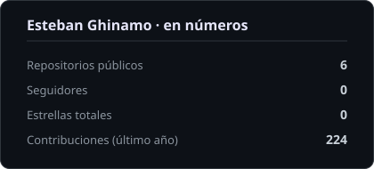
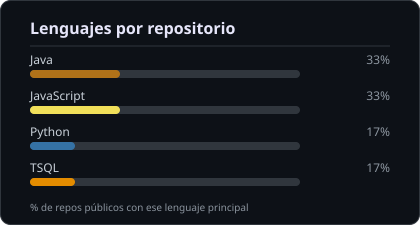

&nbsp;&nbsp;
&nbsp;&nbsp;

  

---

### 🧑‍💻 Sobre mí

- 🎓 Ingeniero en Informática — **Universidad Blas Pascal** (2025), con formación técnica previa como Técnico en Informática (Instituto Técnico de Río Tercero).
- 💼 Desarrollador Full Stack Junior. Como freelance entregué a un cliente real, **[GriffonVet](https://www.griffonvet.com.ar)**, una plataforma web y móvil de gestión con **30 endpoints REST** y un modelo relacional de **26 tablas**, en 7 semanas.
- 🧩 Trabajé en equipos Scrum con **Angular, Spring Boot, Node.js/Express, React y SQL Server**.
- 🤖 Sumo desarrollo asistido por IA (**Claude, Claude Code**) y automatización con **GitHub Actions** al flujo diario de trabajo.
- 📍 Almafuerte, Córdoba, Argentina 🇦🇷

---

### 🛠️ Stack

 

---

### 🚀 Proyectos destacados

| Proyecto | Descripción | Stack |
|---|---|---|
| 🌐 [**GriffonVet**](https://www.griffonvet.com.ar) — cliente real | Plataforma web y móvil de gestión para una clínica veterinaria (clientes, mascotas, historias clínicas), con autenticación y 2 roles de acceso. Reemplazó el registro en planillas físicas por un sistema digital centralizado: **30 endpoints REST**, modelo relacional de **26 tablas**, entregado en 7 semanas. | Backend · REST API · Modelado relacional |
| [**Sistema-de-restaurante**](https://github.com/estebanghinamo/Sistema-de-restaurante) — *Ristorino* | Plataforma de reservas y promoción de restaurantes. Arquitectura basada en **microservicios**, combinando **REST y SOAP**, para conectar **4 restaurantes** en una única plataforma, resolviendo la heterogeneidad de los sistemas existentes. Suma **IA generativa (Google Gemini)** para promociones automáticas y un motor de **búsqueda semántica**. Reservas, ranking, recomendaciones, favoritos y feedback con soporte **multilenguaje (i18n)**. Equipo de 3 personas, sprints Scrum de 12 semanas, con procedimientos almacenados avanzados en SQL Server. | Angular · Spring Boot · SQL Server · REST · SOAP · IA (Gemini) |
| [**Contract_AR**](https://github.com/estebanghinamo/Contract_AR) | Plataforma de gestión y firma de contratos digitales. Backend en Node.js/Express conectado a PostgreSQL, en equipo Scrum de 4 integrantes; firma digital con wallets Web3 y almacenamiento descentralizado en **Polygon + IPFS**, pasarela de pagos (Mercado Pago) y panel administrativo con KPIs. | Node.js · Express · React · PostgreSQL · Polygon · IPFS |
| [**CompiladorJava**](https://github.com/estebanghinamo/CompiladorJava) | Compilador en Java con ANTLR4: análisis léxico, sintáctico, semántico, generación de código intermedio (C3D) y optimización | Java · ANTLR4 |
| [**ClinicaMedica**](https://github.com/estebanghinamo/ClinicaMedica) | Aplicación de escritorio en **JavaFX** para la gestión integral de una clínica médica: pacientes, personal, turnos, órdenes de consulta e historial clínico. Arquitectura en capas con patrón **DAO + Factory** y acceso a datos por JDBC puro. | JavaFX · Java · MySQL |
| [**Reservalo**](https://github.com/estebanghinamo/Reservalo) | Gestión de reservas de turnos para peluquerías, con panel de administración (AdminLTE) e integración con **Google Calendar API** para recordatorios automáticos | PHP · CodeIgniter · MySQL · Google Calendar |
| [**Sistema-de-Optimizacion-de-Recorridos**](https://github.com/estebanghinamo/Sistema-de-Optimizacion-de-Recorridos) — *Travel Planner Multidestino* | Planificador de viajes multidestino: grafo de ciudades con **Dijkstra**, **TSP con memoización** para múltiples ciudades, cache **LRU/Redis**, reservas asíncronas con **procesamiento batch** y recomendaciones con **IA (Gemini)**. Trabajo final de Programación Eficiente, en equipo de 3. | FastAPI · Streamlit · Pytest |
| 🧠 [**hopfield-ai**](https://github.com/estebanghinamo/hopfield-ai) | Red neuronal de **Hopfield** con interfaz gráfica (Tkinter) para reconocimiento de patrones/letras en grilla 5x5: cálculo de la matriz de pesos, reconocimiento iterativo por convergencia, entrenamiento dinámico de nuevos patrones y sugerencia por **distancia de Hamming**. Trabajo práctico de Sistemas Inteligentes Artificiales. | Python · NumPy · IA (redes neuronales) |

---

### 📊 Estadísticas

---

Hecho con café y muchos <code>git commit</code> · Córdoba, Argentina

